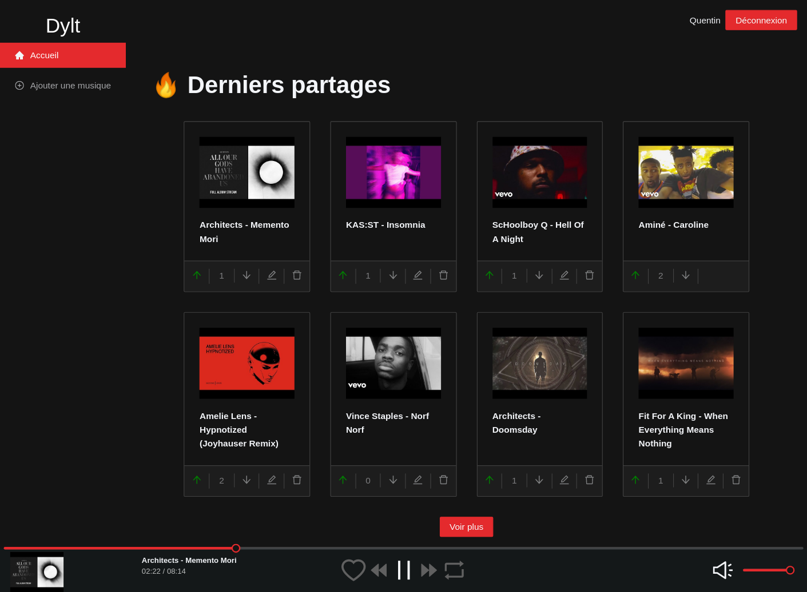
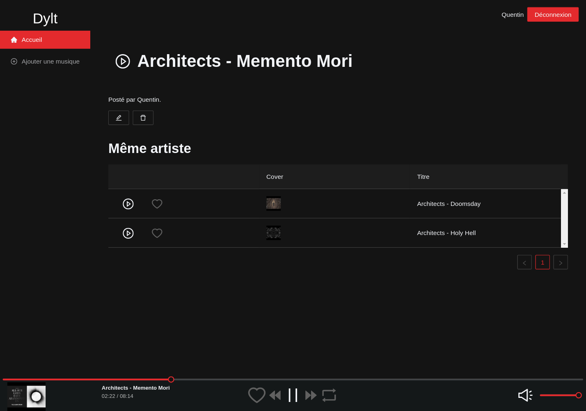

# Dylt, discover new music

Streaming platform for discovering music.

I'm building this project to learn TypeScript and NextJS as well as updating my playlists with good songs.

**[Live version :rocket: ](https://dylt.quentinbrohan.dev)**

## :sparkles: Features

- Show musics shared by members
- Show track page and same artist results
- Custom Audio player
- Add/Delete*/Edit* track (*if creator)
- Upvote/Downvote track
- Cookies session

## :construction: WIP

- Search function | V2 - includes BPM, genre, label, etc
- Favorite track function
- Improve audio player (avoid cut on page change, + fav/prev/next buttons)
- Playlist on track/search page if multiple results
- Profile page, used to show your infos and favorites
- Roles admin/user for managing content
- V2 | Rework track to includes artist, name, remix, ref, label, bpm, genre
- V2 | CreateTrack => Automatic track infos fetching from YouTube URL through html parsing
- V2 | Extends player to SoundCloud url :eyes:
- V2 | TrackPage => Show similar tracks

## Stack

### Front

- TypeScript

- React

- NextJs

- URQL

- Ant Design

### Back

- Node

- TypeGraphQL

- TypeORM

- PostgresQL




## How to run

### Back

(I'll simplify this soon with a docker composer)

**You need PostgresQL installed with root access !**

#### In the server folder

Changes .env with

```shell
postgresql:/<YOURNAME>:<YOURPASSWORD>@localhost:5432/<YOURDBNAME>
```

```shell
yarn
```

First terminal tab

```shell
yarn watch
```

Second terminal tab

```shell
yarn dev
```

Server should be started and migration (InitialDB) runs with a clean database.

### Front

#### In the client folder

```shell
yarn
```

```shell
yarn dev
```
